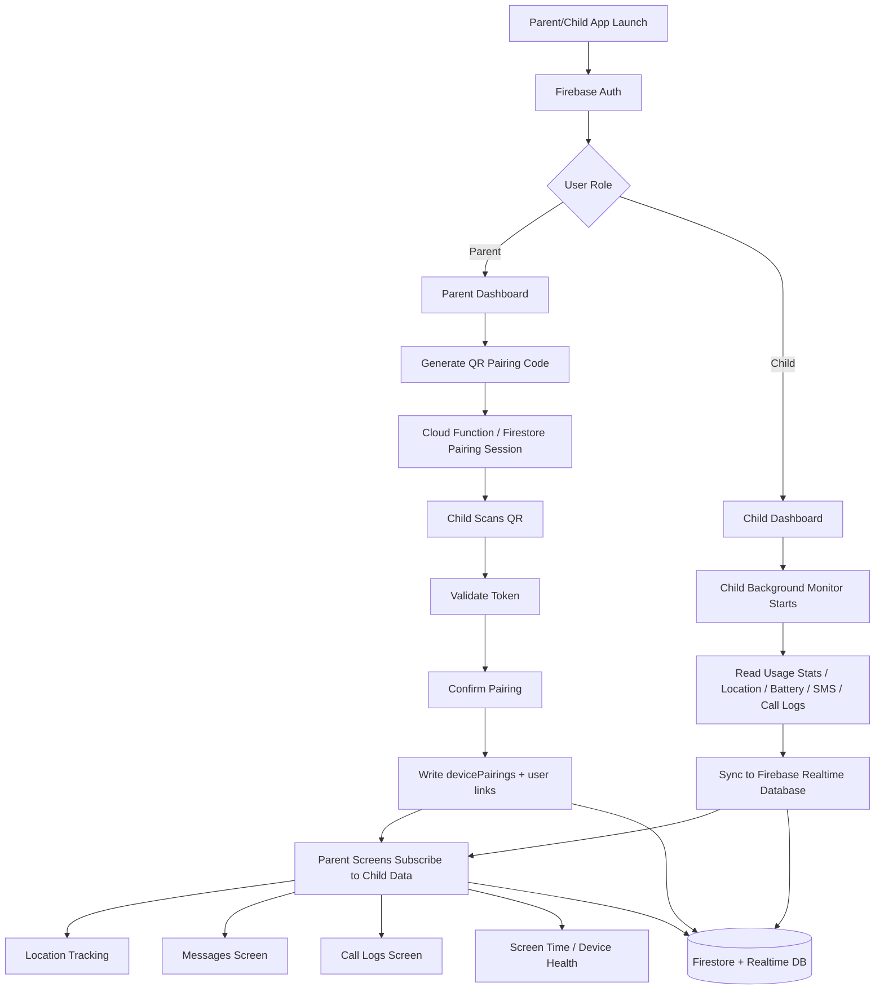

# Parental Control App Architecture

This document describes how the app is wired end to end: authentication, pairing, child background sync, and parent-facing views.

## High-level flow

## What each layer does

- React Native and Expo Router handle UI and navigation.
- Firebase Auth identifies the signed-in parent or child.
- Firestore stores pairing metadata and relationship documents.
- Realtime Database stores fast-changing device telemetry and history.
- Native Android code collects system data that React Native cannot read directly.
- Parent screens render live subscriptions from the child device records.

## Runtime responsibilities

- Parent app:
  - Creates pairing sessions.
  - Reads live child data.
  - Shows location, messages, call logs, and device status.
- Child app:
  - Starts the background monitor when paired.
  - Collects usage, location, battery, SMS, and call data.
  - Syncs records to Firebase on a timer.
- Backend:
  - Validates QR pairing tokens.
  - Writes pairing relationships.
  - Enforces auth and database rules.

## Important data paths

- Firestore:
  - `pairingSessions`
  - `devicePairings`
  - `users/{userId}/children`
  - `users/{userId}/devices`
- Realtime Database:
  - `devices/{uid}`
  - `locations/{uid}`
  - `screenTime/{uid}`
  - `callHistory/{uid}`
  - `messageHistory/{uid}`

## Notes for developers

- The map screen on Android uses Google Maps SDK, so it needs an API key in the native manifest.
- Realtime Database queries that use `orderByChild('timestamp')` need `.indexOn` rules for performance.
- Native module changes require a rebuild, not just a reload.
- If the parent screen is empty, check both the pairing record and the child sync pipeline.
